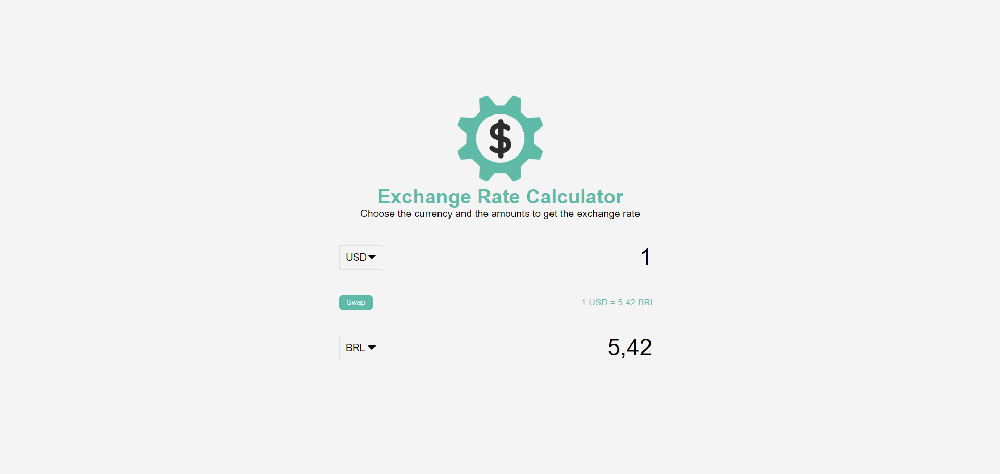

<h1>Exchange Rate Calculator</h1>
<h4>Projeto conversor de moedas</h4>
<h2>Tecnologias utilizadas</h2>

  
  
  

<h4  style="display: inline_block">Visualização do site :</h4><a style="display: inline_block" target="blank" href="https://joao5142.github.io/vanillawebprojects/rateCalculator/">Preview no Github Pages</a>

